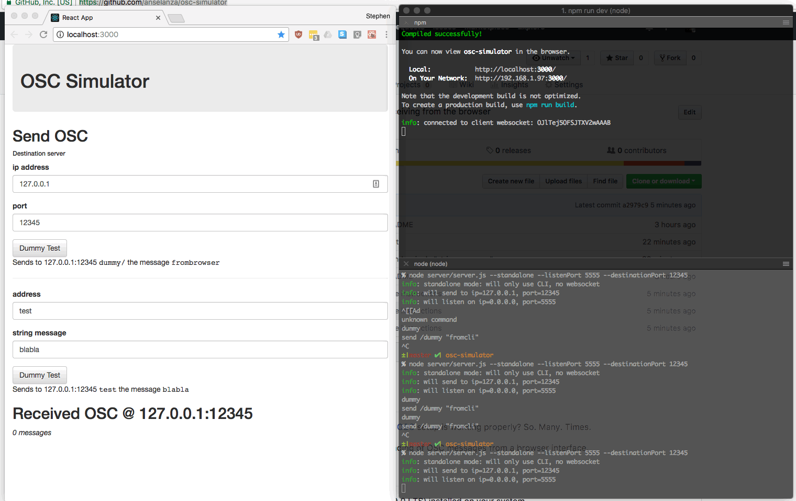

# OSC Simulator
How many times have I just needed to test my [OSC](http://opensoundcontrol.org/) setup is working properly? So.  Many. Times.

Here is an easy utility to test receiving and sending of OSC messages from a browser interface.



## Installation
You need to have [Node](https://nodejs.org) (tested with Node v8.9.0 LTS) installed on your system.

After cloning, `cd` to the `osc-simulator` folder and run
```
npm install
```

## Basic usage
### Build and launch
Launch the *server*, build and open the *browser* interface in one step:
```
npm run dev
```

A faster "static build" option will be coming soon.

### Test receiving messages
By default, the OSC Simulator server will listen on port `12345` and is bound to ip `0.0.0.0`.

So point your OSC client or application to send to the IP address of the machine that OSC Simulator is running on (or just `127.0.0.1`) and you should see incoming OSC messages logged nicely:
* incoming OSC messages are logged by the Node server in the terminal
* OSC messages are shown in the browser interface, too, under the heading "Received OSC @ 127.0.0.1:12345"

### Test sending messages
For now, you have two options:
* Send to the address "/dummy" with a single string argument ("frombrowser")
* Send to a *custom* address with a single *custom* string argument

In either case, you can send to the default (the OSC Simulator server itself!) @ `127.0.0.1:12345` or enter the destination IP address and port for your OSC client application.

## Configuration
This project uses the excellent configuration manager for Node, [rc](https://www.npmjs.com/package/rc). That means you have a number of options for overriding the default settings.

For example, you can override from the command line:
```
node server/server.js --sending.ip=192.168.1.170
```
Or create your own `.osc-simulatorrc` file in the root of the project and use JSON to override the properties you want (these get *merged* into the defaults, so just specify the things you want to change):
```
  {
    "sending": {
      "ip": "192.168.1.170",
      "port": 12345
    },
    "receiving": {
      "port": 12346
    }
  }
```
Using a file is nice because you get to persist your settings. Command line arguments will always take precedence, though.

## Logging
Logging on the server side is provided by the venerable [Winston](https://www.npmjs.com/package/winston).

#### Logging high frequency messages
To debug fast-moving streams of OSC data, it can be helpful to write everything to disk so you can search, etc. 

OSC Simulator allows you to optionally log to file (in addition to the console) by setting `--logging.toFile=true` on the command line or overriding elsewhere (as described above).

You can also disable the "received" message list on the front end (useful if you're expected a lot of high-frequency incoming messages) by setting `--logging.frontEndMessages=false`

## CLI and Standalone Mode
### CLI usage
Launch the node server manually:
```
node server/server.js
```
If you pass no extra arguments, the server sets a default destination+port (`127.0.0.1:12345`) and listens on the default `0.0.0.0:12345`. In other words, you will be sending OSC messages from the server to itself. And these will be visible in the browser UI if you have it open.

Now you can type commands in the terminal, followed by return. Here is the list of commands so far:
* `dummy`: send to the address "/dummy" with a single string argument ("fromcli")
* `send {address} [args]`: send to the `{address}`, with optional `[args]` (separate with spaces), e.g. `send /test one two three`

### Standalone Mode
It can be very useful to run the server as simple OSC client and/or server, either to initiate OSC commands to a remote application or to simply log any incoming OSC messages... without relaying these to the browser UI.

To do this, just launch in standalone mode:
```
node server/server.js --standalone true
```
...or, equivalently:
```
npm run standalone
```

Even better, you can specify any or all of the destination/server IP and port settings. For example:
```
node server/server.js --standalone true --receiving.ip 5555 --sending.port 12345 --sending.ip 192.168.1.99
```
...which is the same as:
```
npm run standalone -- --receiving.ip 5555 --sending.port 12345 --sending.ip 192.168.1.99
```

This means you can even launch the system with a basic setup (`npm run dev`) and then start a second instance of `server.js` in standalone mode to test relaying OSC messages to another server instance from the browser.

## How it works
Browsers are not allowed to send or receive UDP packets. But Node servers can. This OSC Simulator uses a websocket (typically on port `5000`) to act as a relay between the "frontend" in the browser and the "backend" Node server.

Messages initiated from the browser:
1. Websocket message sent to Node server
1. Node server relays the message via OSC

And the other way around. Incoming OSC messages:
1. Received by the Node server, if it's listening on the correct port
1. Node server relays messages via a Websocket message to the browser UI

## Roadmap
Some ideas for improvements:
* Allow arbitrary adding, removing and re-ordering of arguments (of configurable types) through a simple interface
* Allow saving/loading of preset messages (with their argument types and ordering)
* Serve pre-built frontend via Express rather than compiling every time
* Dockerise for easy portability
